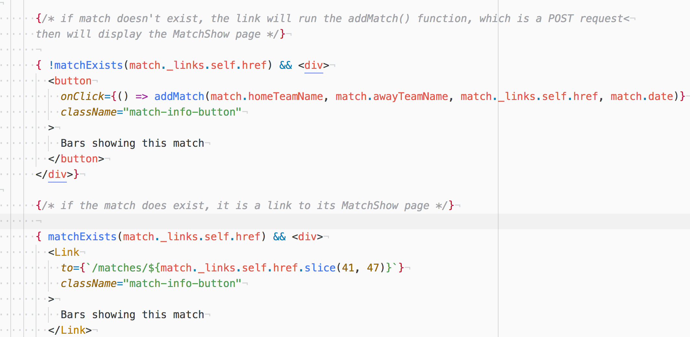

# awayGame 2.0

This is a rebuild of a [previous project of mine](https://github.com/guillermograham/wdi-project-2) and is my first large project since completing the General Assembly WDI Course.

The application allows bars in Barcelona to create a page for their bar, and display the football matches that they will be screening.

I wanted to use this project as an opportunity to advance my understanding of using third-party APIs. Additionally, I wanted to further develop my understanding of React.

The application consumes a third-party API for up-to-date football information, so bar owners can view a list of all matches, and click to add to a particular match to the list of the matches that they are screening.

### Installation and Setup

**Run locally**

* Download or clone the GitHub repo

### Technologies used

During the creation of this project, I used the following technologies:

* Axios
* Babel
* bcrypt
* Bluebird
* Body-parser
* Bulma.io
* Express
* Font Awesome
* Git
* GitHub
* HTML 5
* JavaScript (ECMAScript 6)
* JSON Web Token
* MongoDB
* Mongoose
* Morgan
* Node.js
* React
* React-Moment
* Request-Promise
* SCSS
* Webpack

### APIs used

* football-data.org
* Google Maps
* Google Geocoding

### Wins

* The application consumes data from the Football-Data. A Get request is made from the back-end to the football-data.org API when a user loads the MatchesIndex page. With the response, all Premiership Matches are loaded on the screen.

When a user clicks on a particular match (in order to see the bars screening this match), a record for this match is created in the database if it didn't already exist.

The front-end knows if a match already exists on the database as it makes a GET request to the back-end on page load and all matches are saved to state. Where the user sees a link to MatchShow, it either sends a GET request to the back-end (if the match exists) or a POST request with the match details (if the match doesn't exist).

<kbd>
  
</kbd>
